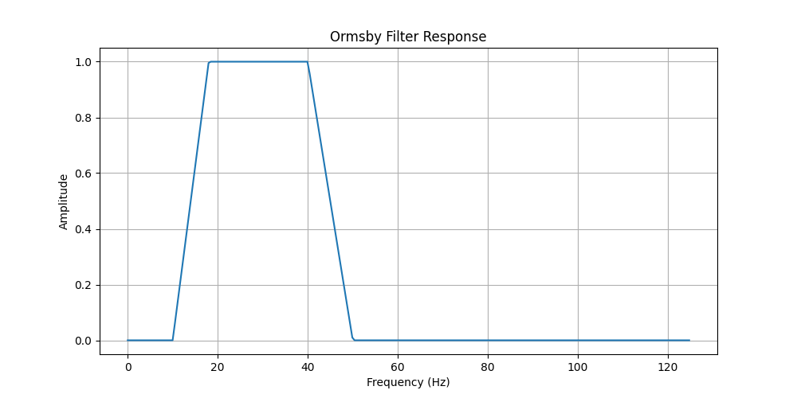
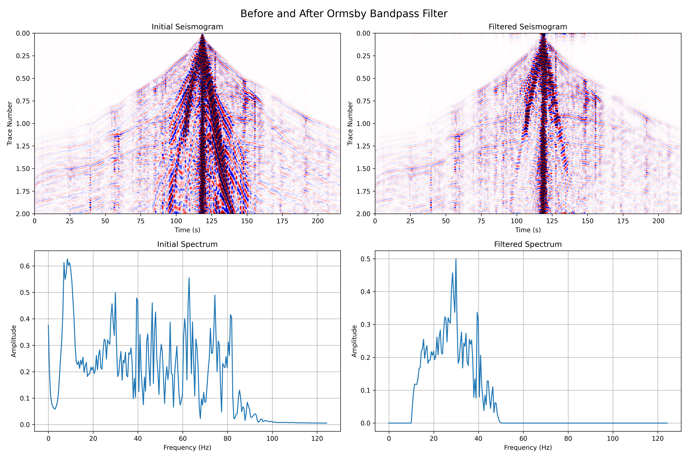

# Ormsby Bandpass Filter for Seismograms

This repository provides a simple C++ implementation of the **Ormsby Bandpass Filter (BPF)** for seismogram data. It includes a reusable library (`ormsbybpf.h`) and a test program (`test.cpp`) for reading seismic traces, applying the filter, and saving the results. Requires FFTW3 library.

## Features

- Computes an Ormsby bandpass filter with given corner frequencies.
- Applies the filter in the frequency domain to multi-trace seismogram data.
- The Ormsby filter is defined by four corner frequencies:  
`f1`, `f2`, `f3`, and `f4` (in Hz), forming a trapezoidal passband.

## Usage
```cpp
// your includes...
#include "ormsbybpf.h"
// ...

// somehow you read a seismogram to std::vector<std::vector<double>>
// Slow axis is traces, fast axis is samples
std::vector<std::vector<double>> seismogram = readSeismogram(input_file, n_traces, n_samples);

// set params
double dt = 0.004
double f1 = 10.0
double f2 = 18.0
double f3 = 40.0
double f4 = 50.0
// apply Ormsby Bandpass Filter
std::vector<std::vector<double>> seismogramFiltered = ormsbyBPF(seismogram, dt, f1, f2, f3, f4);
```
## Compiling and running the testing program

```bash
# Build
mkdir build
cd build
cmake ..
make

# Run
./test
```

## Files
- ```include/ormsbybpf.h``` – library header file
- ```source/ormsbybpf.cpp``` - library source file
- ```source/test.cpp``` – example of applying the filter to real data
- ```data/``` – input/output binary files and filter response CSV
- ```pic/``` - pictures generated by view_result.py
- ```view_result.py``` - python script for visualizing results

## Pictures preview 
<br> 
 

### Dependencies
- Standard C++17
- FFTW3 for efficient Fourier transforms
